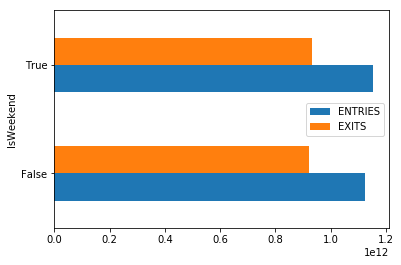

# Understanding Pandas Series and DataFrames - Lab

## Introduction

In this lab, let's get some hands on practice working with data cleanup using Pandas.

## Objectives
You will be able to:

* Manipulate columns in DataFrames (df.rename, df.drop)
* Manipulate the index in DataFrames (df.reindex, df.drop, df.rename)
* Manipulate column datatypes

## Let's get started!


```python
import pandas as pd
import matplotlib.pyplot as plt
%matplotlib inline
```


```python
df = pd.read_csv('turnstile_180901.txt')
print(len(df))
df.head()
```

    197625


<div>
<style>
    .dataframe thead tr:only-child th {
        text-align: right;
    }

    .dataframe thead th {
        text-align: left;
    }

    .dataframe tbody tr th {
        vertical-align: top;
    }
</style>
<table border="1" class="dataframe">
  <thead>
    <tr style="text-align: right;">
      <th></th>
      <th>C/A</th>
      <th>UNIT</th>
      <th>SCP</th>
      <th>STATION</th>
      <th>LINENAME</th>
      <th>DIVISION</th>
      <th>DATE</th>
      <th>TIME</th>
      <th>DESC</th>
      <th>ENTRIES</th>
      <th>EXITS</th>
    </tr>
  </thead>
  <tbody>
    <tr>
      <th>0</th>
      <td>A002</td>
      <td>R051</td>
      <td>02-00-00</td>
      <td>59 ST</td>
      <td>NQR456W</td>
      <td>BMT</td>
      <td>08/25/2018</td>
      <td>00:00:00</td>
      <td>REGULAR</td>
      <td>6736067</td>
      <td>2283184</td>
    </tr>
    <tr>
      <th>1</th>
      <td>A002</td>
      <td>R051</td>
      <td>02-00-00</td>
      <td>59 ST</td>
      <td>NQR456W</td>
      <td>BMT</td>
      <td>08/25/2018</td>
      <td>04:00:00</td>
      <td>REGULAR</td>
      <td>6736087</td>
      <td>2283188</td>
    </tr>
    <tr>
      <th>2</th>
      <td>A002</td>
      <td>R051</td>
      <td>02-00-00</td>
      <td>59 ST</td>
      <td>NQR456W</td>
      <td>BMT</td>
      <td>08/25/2018</td>
      <td>08:00:00</td>
      <td>REGULAR</td>
      <td>6736105</td>
      <td>2283229</td>
    </tr>
    <tr>
      <th>3</th>
      <td>A002</td>
      <td>R051</td>
      <td>02-00-00</td>
      <td>59 ST</td>
      <td>NQR456W</td>
      <td>BMT</td>
      <td>08/25/2018</td>
      <td>12:00:00</td>
      <td>REGULAR</td>
      <td>6736180</td>
      <td>2283314</td>
    </tr>
    <tr>
      <th>4</th>
      <td>A002</td>
      <td>R051</td>
      <td>02-00-00</td>
      <td>59 ST</td>
      <td>NQR456W</td>
      <td>BMT</td>
      <td>08/25/2018</td>
      <td>16:00:00</td>
      <td>REGULAR</td>
      <td>6736349</td>
      <td>2283384</td>
    </tr>
  </tbody>
</table>
</div>


## Rename all the columns to lower case


```python
new_cols = [col.lower() for col in df.columns]
#set equal to df.columns if you want the change to take place
new_cols
```


    ['c/a',
     'unit',
     'scp',
     'station',
     'linename',
     'division',
     'date',
     'time',
     'desc',
     'entries',
     'exits                                                               ']


## Change the Index to be the Line Names


```python
df = df.set_index('LINENAME')
df.head()
```


<div>
<style>
    .dataframe thead tr:only-child th {
        text-align: right;
    }

    .dataframe thead th {
        text-align: left;
    }

    .dataframe tbody tr th {
        vertical-align: top;
    }
</style>
<table border="1" class="dataframe">
  <thead>
    <tr style="text-align: right;">
      <th></th>
      <th>C/A</th>
      <th>UNIT</th>
      <th>SCP</th>
      <th>STATION</th>
      <th>DIVISION</th>
      <th>DATE</th>
      <th>TIME</th>
      <th>DESC</th>
      <th>ENTRIES</th>
      <th>EXITS</th>
    </tr>
    <tr>
      <th>LINENAME</th>
      <th></th>
      <th></th>
      <th></th>
      <th></th>
      <th></th>
      <th></th>
      <th></th>
      <th></th>
      <th></th>
      <th></th>
    </tr>
  </thead>
  <tbody>
    <tr>
      <th>NQR456W</th>
      <td>A002</td>
      <td>R051</td>
      <td>02-00-00</td>
      <td>59 ST</td>
      <td>BMT</td>
      <td>08/25/2018</td>
      <td>00:00:00</td>
      <td>REGULAR</td>
      <td>6736067</td>
      <td>2283184</td>
    </tr>
    <tr>
      <th>NQR456W</th>
      <td>A002</td>
      <td>R051</td>
      <td>02-00-00</td>
      <td>59 ST</td>
      <td>BMT</td>
      <td>08/25/2018</td>
      <td>04:00:00</td>
      <td>REGULAR</td>
      <td>6736087</td>
      <td>2283188</td>
    </tr>
    <tr>
      <th>NQR456W</th>
      <td>A002</td>
      <td>R051</td>
      <td>02-00-00</td>
      <td>59 ST</td>
      <td>BMT</td>
      <td>08/25/2018</td>
      <td>08:00:00</td>
      <td>REGULAR</td>
      <td>6736105</td>
      <td>2283229</td>
    </tr>
    <tr>
      <th>NQR456W</th>
      <td>A002</td>
      <td>R051</td>
      <td>02-00-00</td>
      <td>59 ST</td>
      <td>BMT</td>
      <td>08/25/2018</td>
      <td>12:00:00</td>
      <td>REGULAR</td>
      <td>6736180</td>
      <td>2283314</td>
    </tr>
    <tr>
      <th>NQR456W</th>
      <td>A002</td>
      <td>R051</td>
      <td>02-00-00</td>
      <td>59 ST</td>
      <td>BMT</td>
      <td>08/25/2018</td>
      <td>16:00:00</td>
      <td>REGULAR</td>
      <td>6736349</td>
      <td>2283384</td>
    </tr>
  </tbody>
</table>
</div>


## Change the index back


```python
df = df.reset_index() 
df.head()
```


<div>
<style>
    .dataframe thead tr:only-child th {
        text-align: right;
    }

    .dataframe thead th {
        text-align: left;
    }

    .dataframe tbody tr th {
        vertical-align: top;
    }
</style>
<table border="1" class="dataframe">
  <thead>
    <tr style="text-align: right;">
      <th></th>
      <th>LINENAME</th>
      <th>C/A</th>
      <th>UNIT</th>
      <th>SCP</th>
      <th>STATION</th>
      <th>DIVISION</th>
      <th>DATE</th>
      <th>TIME</th>
      <th>DESC</th>
      <th>ENTRIES</th>
      <th>EXITS</th>
    </tr>
  </thead>
  <tbody>
    <tr>
      <th>0</th>
      <td>NQR456W</td>
      <td>A002</td>
      <td>R051</td>
      <td>02-00-00</td>
      <td>59 ST</td>
      <td>BMT</td>
      <td>08/25/2018</td>
      <td>00:00:00</td>
      <td>REGULAR</td>
      <td>6736067</td>
      <td>2283184</td>
    </tr>
    <tr>
      <th>1</th>
      <td>NQR456W</td>
      <td>A002</td>
      <td>R051</td>
      <td>02-00-00</td>
      <td>59 ST</td>
      <td>BMT</td>
      <td>08/25/2018</td>
      <td>04:00:00</td>
      <td>REGULAR</td>
      <td>6736087</td>
      <td>2283188</td>
    </tr>
    <tr>
      <th>2</th>
      <td>NQR456W</td>
      <td>A002</td>
      <td>R051</td>
      <td>02-00-00</td>
      <td>59 ST</td>
      <td>BMT</td>
      <td>08/25/2018</td>
      <td>08:00:00</td>
      <td>REGULAR</td>
      <td>6736105</td>
      <td>2283229</td>
    </tr>
    <tr>
      <th>3</th>
      <td>NQR456W</td>
      <td>A002</td>
      <td>R051</td>
      <td>02-00-00</td>
      <td>59 ST</td>
      <td>BMT</td>
      <td>08/25/2018</td>
      <td>12:00:00</td>
      <td>REGULAR</td>
      <td>6736180</td>
      <td>2283314</td>
    </tr>
    <tr>
      <th>4</th>
      <td>NQR456W</td>
      <td>A002</td>
      <td>R051</td>
      <td>02-00-00</td>
      <td>59 ST</td>
      <td>BMT</td>
      <td>08/25/2018</td>
      <td>16:00:00</td>
      <td>REGULAR</td>
      <td>6736349</td>
      <td>2283384</td>
    </tr>
  </tbody>
</table>
</div>


## Create another column 'Num_Lines' that is a count of how many lines pass through a station. Then sort your dataframe by this column in descending order
*Hint: According to the [data dictionary](http://web.mta.info/developers/resources/nyct/turnstile/ts_Field_Description.txt), LINENAME represents all train lines that can be boarded at a given station. Normally lines are represented by one character. For example, LINENAME 456NQR represents trains 4, 5, 6, N, Q, and R.*


```python
df['Num_Lines'] = df.LINENAME.map(lambda x: len(x))
```

## Write a function to clean a column name


```python
def clean(col_name):
    cleaned = col_name.strip()#Your code here; whatever you want to do to col_name. Hint: think back to str methods.
    return cleaned
```


```python
# This is a list comprehension. It applies your clean function to every item in the list.
# We then reassign that to df.columns
# You shouldn't have to change anything here.
# Your function above should work appropriately here.
df.columns = [clean(col) for col in df.columns] 
```


```python
# Checking the output, we can see the results.
df.columns
```


    Index(['C/A', 'UNIT', 'SCP', 'STATION', 'LINENAME', 'DIVISION', 'DATE', 'TIME',
           'DESC', 'ENTRIES', 'EXITS', 'Num_Lines'],
          dtype='object')


## Group the Data by Day of Week and Plot the Sum of The Numeric Columns


```python
df.DATE = pd.to_datetime(df.DATE)
```


```python
df['Dayofweek'] = df.DATE.dt.dayofweek
```


```python
grouped = df.groupby('Dayofweek').sum()
grouped.plot(kind='barh')
```


    <matplotlib.axes._subplots.AxesSubplot at 0x1d90f543ac8>


```python
df.DATE.dt.dayofweek?
```

## Group the Data by Weekend/Weekday and Plot the Sum of the Numeric Columns


```python
grouped = grouped.reset_index()
grouped.head()
```


<div>
<style>
    .dataframe thead tr:only-child th {
        text-align: right;
    }

    .dataframe thead th {
        text-align: left;
    }

    .dataframe tbody tr th {
        vertical-align: top;
    }
</style>
<table border="1" class="dataframe">
  <thead>
    <tr style="text-align: right;">
      <th></th>
      <th>Dayofweek</th>
      <th>ENTRIES</th>
      <th>EXITS</th>
      <th>Num_Lines</th>
    </tr>
  </thead>
  <tbody>
    <tr>
      <th>0</th>
      <td>0</td>
      <td>1114237052454</td>
      <td>911938153513</td>
      <td>76110</td>
    </tr>
    <tr>
      <th>1</th>
      <td>1</td>
      <td>1143313287046</td>
      <td>942230721477</td>
      <td>77303</td>
    </tr>
    <tr>
      <th>2</th>
      <td>2</td>
      <td>1123655222441</td>
      <td>920630864687</td>
      <td>75713</td>
    </tr>
    <tr>
      <th>3</th>
      <td>3</td>
      <td>1122723988662</td>
      <td>920691927110</td>
      <td>76607</td>
    </tr>
    <tr>
      <th>4</th>
      <td>4</td>
      <td>1110224700078</td>
      <td>906799065337</td>
      <td>75573</td>
    </tr>
  </tbody>
</table>
</div>


```python
grouped['IsWeekend'] = grouped.Dayofweek.map({0:False,1:False,2:False,3:False,4:False,5:True,6:True})
wkend = grouped.groupby('IsWeekend').mean()
wkend[['ENTRIES', 'EXITS']].plot(kind='barh')
```


    <matplotlib.axes._subplots.AxesSubplot at 0x1d90ff5a3c8>





```python
# What Not To Do
grouped['IsWeekend'] = grouped.Dayofweek.map({0:False,1:False,2:False,3:False,4:False,5:True,6:True})
wkend = grouped.groupby('IsWeekend').sum()
wkend[['ENTRIES', 'EXITS']].plot(kind='barh')
```


    <matplotlib.axes._subplots.AxesSubplot at 0x1d90f48fda0>


## Analysis Question: 

What is misleading about the day of week and weekend/weekday charts you just plotted?


```python
# Answer: The raw data for entries/exits is cumulative. 
# As such, you would first need to order the data by time and station, 
# and then calculate the difference in order to produce meaningful aggregations.
```

## Drop a couple of columns


```python
df.head(2)
```


<div>
<style>
    .dataframe thead tr:only-child th {
        text-align: right;
    }

    .dataframe thead th {
        text-align: left;
    }

    .dataframe tbody tr th {
        vertical-align: top;
    }
</style>
<table border="1" class="dataframe">
  <thead>
    <tr style="text-align: right;">
      <th></th>
      <th>LINENAME</th>
      <th>C/A</th>
      <th>UNIT</th>
      <th>SCP</th>
      <th>STATION</th>
      <th>DIVISION</th>
      <th>DATE</th>
      <th>TIME</th>
      <th>DESC</th>
      <th>ENTRIES</th>
      <th>EXITS</th>
    </tr>
  </thead>
  <tbody>
    <tr>
      <th>0</th>
      <td>NQR456W</td>
      <td>A002</td>
      <td>R051</td>
      <td>02-00-00</td>
      <td>59 ST</td>
      <td>BMT</td>
      <td>08/25/2018</td>
      <td>00:00:00</td>
      <td>REGULAR</td>
      <td>6736067</td>
      <td>2283184</td>
    </tr>
    <tr>
      <th>1</th>
      <td>NQR456W</td>
      <td>A002</td>
      <td>R051</td>
      <td>02-00-00</td>
      <td>59 ST</td>
      <td>BMT</td>
      <td>08/25/2018</td>
      <td>04:00:00</td>
      <td>REGULAR</td>
      <td>6736087</td>
      <td>2283188</td>
    </tr>
  </tbody>
</table>
</div>


```python
df = df.drop(['C/A', 'SCP'], axis=1)
df.head(2)
```


<div>
<style>
    .dataframe thead tr:only-child th {
        text-align: right;
    }

    .dataframe thead th {
        text-align: left;
    }

    .dataframe tbody tr th {
        vertical-align: top;
    }
</style>
<table border="1" class="dataframe">
  <thead>
    <tr style="text-align: right;">
      <th></th>
      <th>LINENAME</th>
      <th>UNIT</th>
      <th>STATION</th>
      <th>DIVISION</th>
      <th>DATE</th>
      <th>TIME</th>
      <th>DESC</th>
      <th>ENTRIES</th>
      <th>EXITS</th>
    </tr>
  </thead>
  <tbody>
    <tr>
      <th>0</th>
      <td>NQR456W</td>
      <td>R051</td>
      <td>59 ST</td>
      <td>BMT</td>
      <td>08/25/2018</td>
      <td>00:00:00</td>
      <td>REGULAR</td>
      <td>6736067</td>
      <td>2283184</td>
    </tr>
    <tr>
      <th>1</th>
      <td>NQR456W</td>
      <td>R051</td>
      <td>59 ST</td>
      <td>BMT</td>
      <td>08/25/2018</td>
      <td>04:00:00</td>
      <td>REGULAR</td>
      <td>6736087</td>
      <td>2283188</td>
    </tr>
  </tbody>
</table>
</div>


## Summary

Great! You practiced your data cleanup-skills using Pandas.
